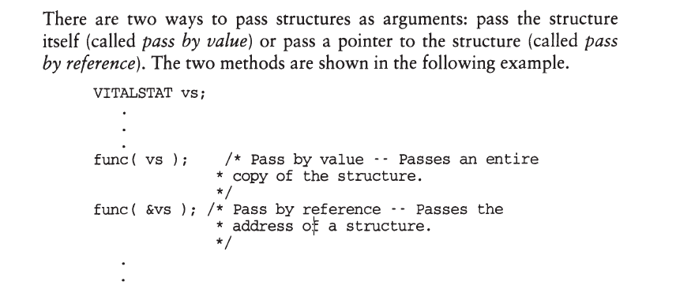
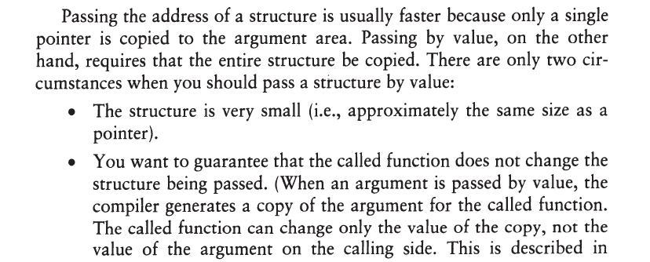
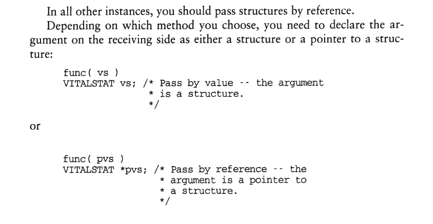

# Structures with Functions

## Passing Structures as Function Arguments








## Passing Structures vs. Passing Arrays

Passing structures is not the same as passing arrays. This inconsistency
in the C language can cause confusion.

To pass an array in C, you simply specify the array name without a
subscript. The compiler interprets the name as a pointer to the initial
element of the array so it really passes the array by reference. There is
no way to pass an array by value (except to embed it in a structure and
pass the structure by value).

With structures, however, the structure name is interpreted as the
entire structure, not as a pointer to the beginning of the structure. If you
use the same syntax that you u e with arrays, therefore, you wiU get
different semantics. For example,

```c
int arr[100];
struct tag st;
    .
    .
    .
func( arr ); /* Passes a pointer to the first element of the array */
              
func( st ); /* Passes Entire Structure */   

```


The inconsistency follows through to the receiving side. For example,
the following two array versions are the same:

```c
void func( int arr[] ); // arr is converted to pointer to an int

void func( int* arr ); // arr is a pointer to an int
```

But the following two structure versions are very different:

```c
void func( struct tag st ); // st is entire structure

void func( struct tag *st ); // st is a pointer to a struct
```

## Returning Structures

Just as it is possible to pass a structure or a pointer to a structure, it is also
possible to return a structure or a pointer to a structure. 

The declaration of the function's return type must agree with the actual returned value.

```c
// function that returns struct
struct tag f(){
    struct tag st;
        // some code
    return st;  // return entire struct    
}

// function that returnsa pointer to a struct
struct tag* f1(){
    static struct tag pst;
        .
        .
        .
    return &pst;    // return the address of the struct
}
```

As with passing structures, you generally want to return pointers to
structures because it is more efficient.
* Note, however, that if you return a
  pointer to a structure, the structure must have fixed duration. Otherwise,
  it will cease to be valid once the function returns.

* One situation for which returning structures is particularly useful is returning
  more than one value.
    * The return statement can send back only one
      expression to the calling routine, but if that expression is a structure or a
      pointer to a structure, you can indirectly return any number of values.

```c
#include<stdio.h>
#include<math.h>        // include for trig functions
#define TOO_LARGE 1e6   // differs from one machine to another

typedef struct{
    double sine,cosine,tangent;
} TRIG;

TRIG* getTrigValues(double radian){
    static TRIG result;
    
    if(radian > TOO_LARGE){
        printf("Input value too large -- cannot return"
                "meaningful results\n");
        return NULL;        
    }
    
    result.sine = sin(radian);
    result.cosine = cos(radian);
    result.tangent = tan(radian);
    
    return &result;
}


```        

## Assigning Structures

ANSI C allows you to assign a structure to a structure variable, provided
they share the same structure type.

```c

struct
{
int a;
float b;
} s1, s2, sf(), *ps;
    .
    .
s1 = s2;
s2 = sf() ;
ps = &s1;
s2 = *ps; 

```

This feature may not be available on older compilers. To assign structures
using older versions of C, you need to use the memcpy() runtime library
function.