# Interprocess Communication

Creating processes is just half the story.

* What if you want to control the process once it’s running? 
* What if you want to send it data? Or read its output? 

Interprocess communication lets processes work together to get the job done. 

## Redirecting

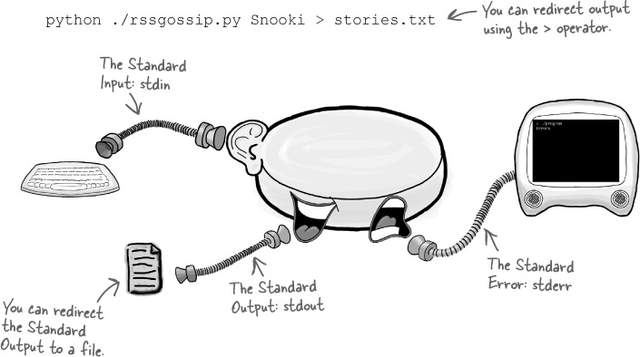

* The Standard Output is one of the three default data streams. 

* A data stream is exactly what it sounds like: a stream of data that goes into, or comes out of, a process. 

* There are data streams for the Standard Input, Output, and Error, and there are also data streams for other things, like **files** or **network connections**. 

* When you redirect the output of a process, you change where the data is sent. 
    * So, instead of the Standard Output sending data to the screen, you can make it send the data to a file.

Redirection is really useful on the command line, but **is there a way of making a process redirect itself**?

### A look inside a typical process

* Every process will contain the program it’s running, as well as space for stack and heap data. 
    * But it will also need somewhere to record where data streams like the Standard Output are connected. 

* Each data stream is represented by a **file descriptor**, which, under the surface, is just a number. 
    * The process keeps everything straight by storing the file descriptors and their data streams in a descriptor table.

        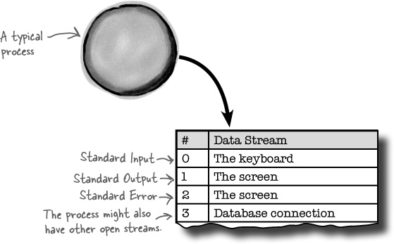

    * The descriptor table has **one column for each of the file descriptor numbers**. 
    * Even though these are called file descriptors, they might not be connected to an actual file on the hard disk. 

* Against every file descriptor, the table records the associated data stream. 
    * That **data stream** might be a connection to the **keyboard or screen**, a **file pointer**, or a **connection to the network**.

* The first three slots in the table are always the same. 
    * Slot 0 is the Standard Input
    * Slot 1 is the Standard Output
    * Slot 2 is the Standard Error. 
    
* The other slots in the table are either empty or connected to data streams that the process has opened. 
    * For example, every time your code opens a file for reading or writing, another slot is filled in the descriptor table.

* When the process is created, the Standard Input is connected to the keyboard, and the Standard Output and Error are connected to the screen. 
    * And they will stay connected that way **until something redirects them** somewhere else.

**File descriptors don’t necessarily refer to files.**

### Redirection just replaces data streams

* The Standard Input, Output, and Error are always fixed in the same places in the descriptor table. 
    * But the **data streams they point to can change**.

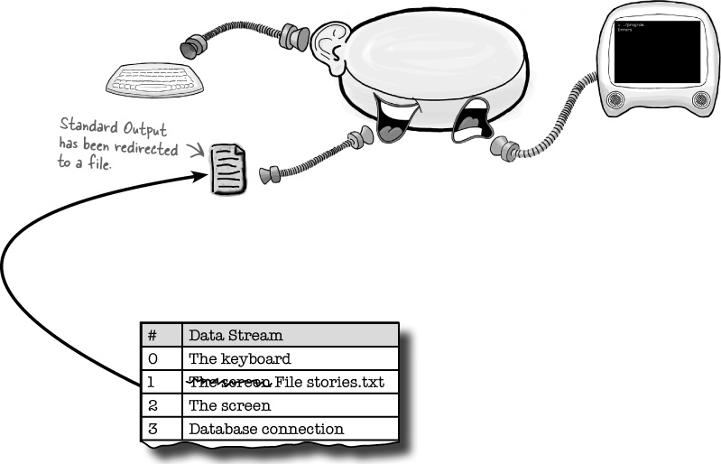

* That means if you want to redirect the Standard Output, you just need to switch the data stream against descriptor 1 in the table.

* All of the functions, like printf(), that send data to the Standard Output will first look in the descriptor table to see where descriptor 1 is pointing. 
    * They will then write data out to the correct data stream.

### PROCESSES CAN REDIRECT THEMSELVES

* Every time you’ve used redirection so far, it’s been from the command line using the > and < operators. 
    * But **processes can do their own redirection by rewiring the descriptor table**.

---

**So, that’s why it’s 2> ...**

You can redirect the Standard Output and Standard Error on the command line using the > and 2> operators:

```bash
./myprog > output.txt 2> errors.log
```
* Now you can see why the Standard Error is redirected with 2>. 
    * The 2 refers to the number of the Standard Error in the descriptor table. 
    * On most operating systems, you can use 1> as an alternative way of redirecting the Standard Output
    * On Unix-based systems you can even redirect the Standard Error to the same place as the Standard Output like this:
    
        
---

### fileno() tells you the descriptor
Every time you open a file, the operating system registers a new item in the descriptor table. 
```c
FILE *my_file = fopen("guitar.mp3", "r");
```
* The operating system will open the guitar.mp3 file and return a pointer to it, but it will also skim through the descriptor table until it finds an empty slot and register the new file there.
    
    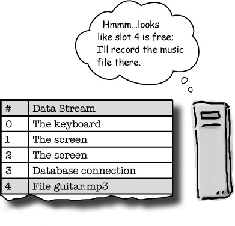

* But once you’ve got a file pointer, how do you find it in the descriptor table?
    * The answer is **by calling the fileno() function**.
    
        

* fileno() is one of the few system functions that doesn’t return –1 if it fails. 
    * As long as you pass fileno() the pointer to an open file, it should always return the descriptor number.

### DUP2() DUPLICATES DATA STREAMS


### Better way for Error Messages


### dup2 Example
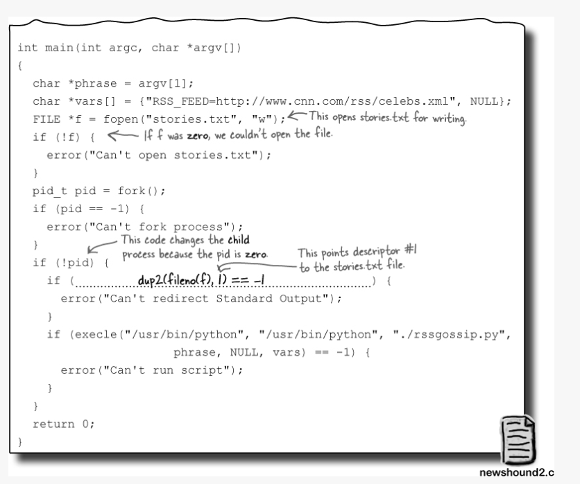

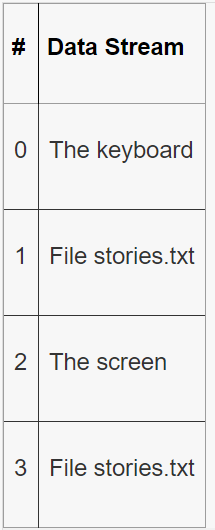

### The waitpid() Function

* The waitpid() function won’t return until the child process dies.

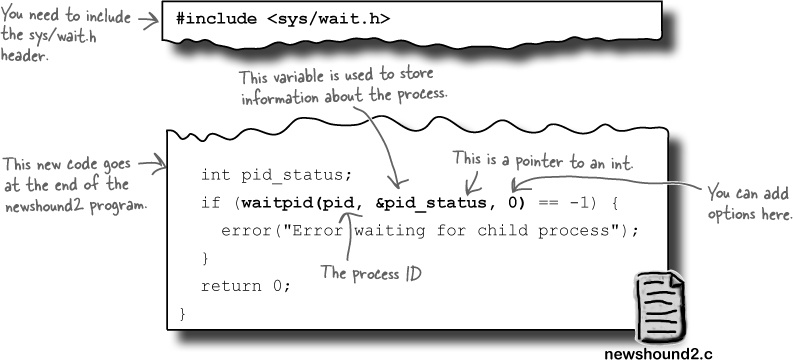

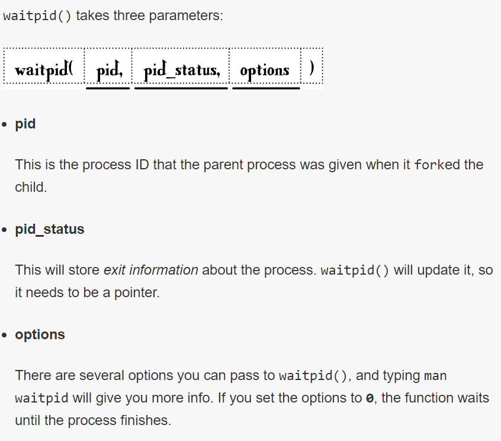

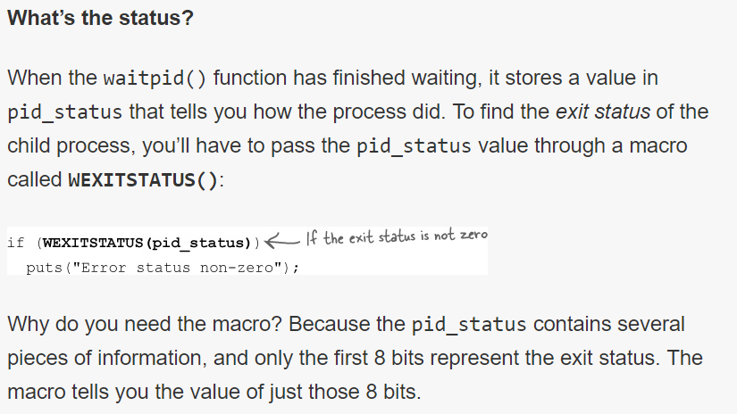

* Redirecting input and output, and making processes wait for each other, are all simple forms of interprocess communication.

### Bullet Points - 1

* exit() is a quick way of ending a program.

* All open files are recorded in the descriptor table.

* You can redirect input and output by changing the descriptor table.

* fileno() will find a descriptor in the table.

* dup2() can be used to change the descriptor table.

* waitpid() will wait for processes to finish.

### Q-A - 1

* Is there a rule about which slot it gets?
    * New files are always added to the available slot with the lowest number. So, if slot number 4 is the first available one, that’s the one your new file will use.

* How big is the descriptor table?
    * It has slots from 0 to 255.

* Is there a way of sending data to the screen without using the Standard Output?
    * On some systems. For example, on Unix-based machines, if you open /dev/tty, it will send data directly to the terminal.

* Can I use waitpid() to wait for any process? Or just the processes I started?
    * You can use waitpid() to wait for any process.

## Communicating With Child Process   

* What if you want to listen to a child process directly? 

* Is that possible? 

* Rather than waiting for a child process to send all of its data into a file and then reading the file afterward, is there some way to start a process running and read the data it generates in real time?

### Connect your processes with pipes


* Pipes are used on the command line to connect the output of one process with the input of another process. 

* In the example here, you’re running the rssgossip.py script manually and then passing its output through a command called grep. The grep command finds all the lines containing http.

#### PIPED COMMANDS ARE PARENTS AND CHILDREN

* Whenever you pipe commands together on the command line, you are actually connecting them together as parent and child processes. 
    * So, in the above example, the **grep** command **is the parent of the rssgossip.py** script.

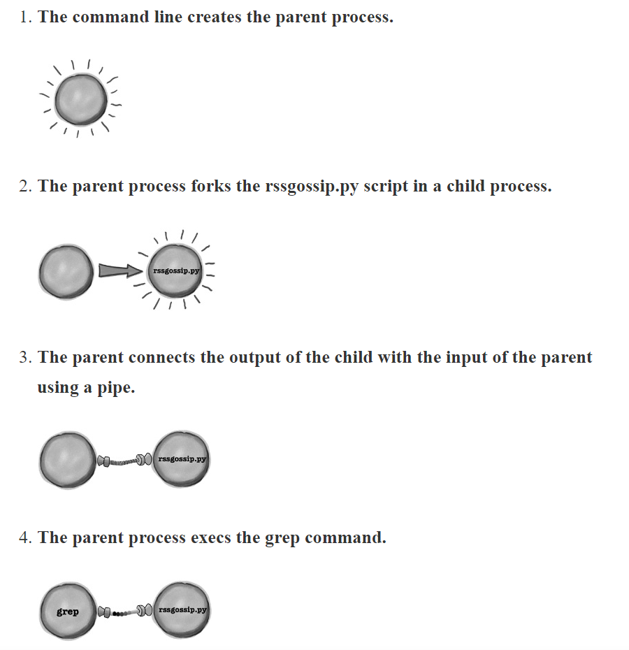

### But how do you create a pipe in C?

> **pipe() OPENS TWO DATA STREAMS**

* Because the child is going to send data to the parent, you need a pipe that’s connected to the Standard Output of the child and the Standard Input of the parent. 
    
    * You’ll create the pipe using the pipe() function. 
    
    * Remember how we said that every time you open a data stream to something like a file, it gets added to the descriptor table? 
    
    * Well, that’s exactly what the pipe() functions does: 
        * it creates two connected streams and adds them to the table. 

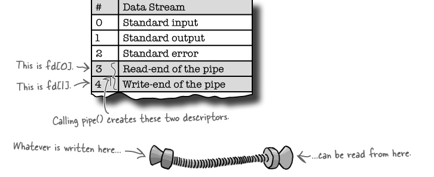

* When pipe() creates the two lines in the descriptor table it will store their file descriptors in a two-element array:
    
    
* The pipe() command creates a pipe and tells you two descriptors: 
    * **fd[0]** is the descriptor that **reads from the pipe**
    * **fd[1]** is the descriptor that **writes to the pipe**
