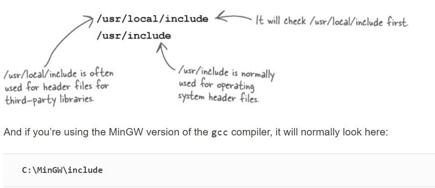
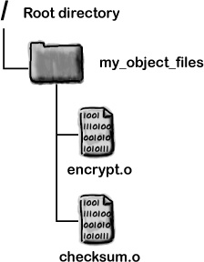
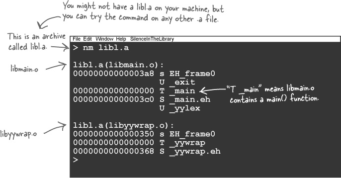

# Static and Dynamic Libraries

#### WHERE ARE THE STANDARD HEADER DIRECTORIES?


## Sharing .h header files

* Store them in a standard directory.
* Put the full pathname in your include statement.
    * such as /my_header_files
* You can tell the compiler where to find them.
    
    
    
## Share .o object files by using the full pathname    
* Now you can always put your .o object files into some sort of shared directory. Once you’ve done that, you can then just add the full path to the object files when you’re compiling the program that uses them:
      
    ```bash
    gcc -I/my_header_files test_code.c
          
    /my_object_files/encrypt.o
          
    /my_object_files/checksum.o -o test_code
    ```
    * Using the full pathname to the object files means you don’t need a separate copy for each C project.
    * /my_object_files is like a central store for your object files.
    
        


## An archive contains .o files

* If you create an archive of object files, you can tell the compiler about a whole set of object files all at once.
    * An archive is just a bunch of object files wrapped up into a single file. By creating a single archive file of all of your security code, you can make it a lot easier to share the code between projects.
   
* The nm command lists the names that are stored inside the archive. 
    
        
    
    * The libl.a archive shown here contains two object files: libmain.o and libyywrap.o. What these two object files are used for doesn’t really matter; the point is that you can take a whole set of object files and turn them into a single archive file that you can use with gcc.
    
### Create an archive with the ar command
The archive command ( ar) will store a set of object files in an archive file:


* Did you notice that all of the .a files have names like lib<something>.a? 
    * That’s the standard way of naming archives. 
    * The names begin with **lib** because they are **static libraries**.

### THEN STORE THE .A IN A LIBRARY DIRECTORY
* You can put your .a file in a standard directory like /usr/local/lib.
* Put the .a file in some other directory.    
    * If you are still developing your code, or if you don’t feel comfortable installing your code in a system directory, you can always create your own library directory.
    
### Finally, compile your other programs


```bash
gcc test_code.c -hfsecurity -o test_code
gcc test_code.c -L/my_lib -lhfsecurity -o test_code
```
* Can you see now why it’s so important to name your archive lib<something>.a? The name that follows the -l option needs to match part of the archive name. So if your archive is called libawesome.a, you can compile your program with the -lawesome switch.

> See the codes inside archieve directory.
    
## Bullet Points

* Headers in angle brackets ( < >) are read from the standard directories.

* Examples of standard header directories are /usr/include and C:\MinGW\include.

* A library archive contains several object files.

* You can create an archive with ar -rcs libarchive.a file0.o file1.o....

* Library archive names should begin lib. and end .a.

* If you need to link to an archive called libfred.a, use -lfred.

* The -L flag should appear after the source files in the gcc command.    

## Notes

* see what’s inside an archive
    * ar -t < filename > will list the contents of the archive.
* extract a single object file from an archive
    ```bash
      # extract encrypt.o from libhfsecurity archieve
      ar -x libhfsecurity.a encrypt.o
    ```
* Why is it called “static” linking?
    * Because it can’t change once it’s been done. When two files are linked together statically, it’s like mixing coffee with milk: you can’t separate them afterward.    
* wanna use linker ?
    ```bash
    ld
    ```    
* How linker works ?
    * Linker stitches pieces of compiled code together.
    * An object file might need to call a function that’s stored in some other file. I link together the point in one file where the function call is made to the point in another file where the function lives.

* -c flag means just create object file.
    ```bash
    gcc -c main.c -o main.o  
    ```