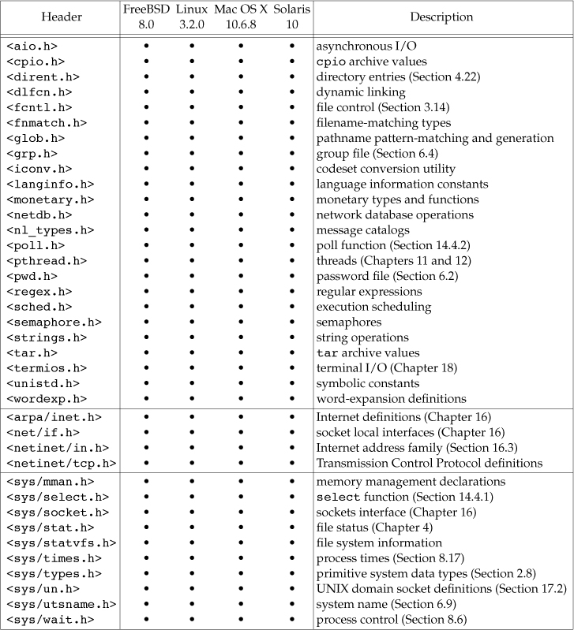
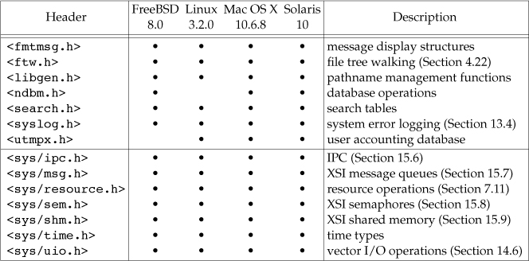
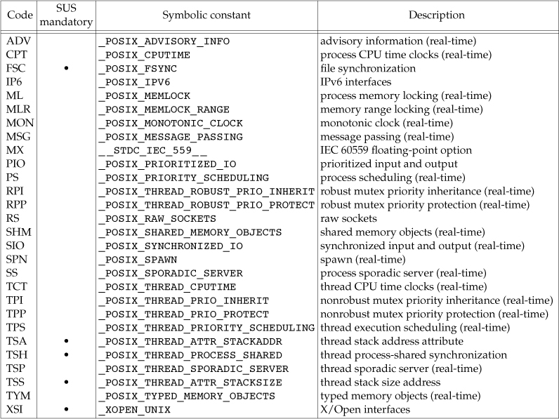
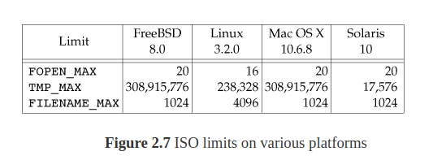

# Unix Standardization

## Standars

### ISO C Standard

* Headers Defined by ISO Standard


### POSIX Standard

* Required Headers defined by POSIX Standard



* XSI option headers defined by POSIX Standard



* Optinal headers defined by POSIX Standard


* Its interfaces are divided into required ones and optional ones.
  * The optional interfaces are further divided into 40 sections, based on functionality.

* POSIX.1 optional interface groups and codes


### Single Unix Specification(SUS)

The Single UNIX Specification, a superset of the POSIX.1 standard, specifies additional interfaces that extend the functionality provided by the POSIX.1 specification. POSIX.1 is equivalent to the Base Specifications portion of the Single UNIX Specification.

---

## Unix System Implementations

* Linux
  * Linux is an operating system that provides a rich programming environment similar to that of a UNIX System; it is freely available under the GNU Public License. The popularity of Linux is somewhat of a phenomenon in the computer industry. Linux is distinguished by often being the first operating system to support new hardware.

## Limits

### ISO C Limits

* Sizes of integral values from <limits.h>


* The floating-point data types in the header <float.h> have a similar set of definitions. 

* POSIX.1 makes extensions to the C standard. To conform to POSIX.1, an implementation must support a minimum value of 2,147,483,647 for INT_MAX, –2,147,483,647 for INT_MIN, and 4,294,967,295 for UINT_MAX. Because POSIX.1 requires implementations to support an 8-bit char, CHAR_BIT must be 8, SCHAR_MIN must be –128, SCHAR_MAX must be 127, and UCHAR_MAX must be 255.

* Another ISO C constant that we’ll encounter is FOPEN_MAX, the minimum number of standard I/O streams that the implementation guarantees can be open at once. This constant is found in the <stdio.h> header, and its minimum value is 8. The POSIX.1 value STREAM_MAX, if defined, must have the same value as FOPEN_MAX.

* ISO C also defines the constant TMP_MAX in <stdio.h>. It is the maximum number of unique filenames generated by the tmpnam function.

* Although ISO C defines the constant FILENAME_MAX, we avoid using it, because POSIX.1 provides better alternatives (NAME_MAX and PATH_MAX). 



### POSIX Limits

POSIX.1 defines numerous constants that deal with implementation limits of the operating system.

* Although POSIX.1 defines numerous limits and constants, we’ll concern ourselves with only the ones that affect the base POSIX.1 interfaces.
  * These limits and constants are divided into the following seven categories:

1. Numerical limits: LONG_BIT, SSIZE_MAX, and WORD_BIT

2. Minimum values: the 25 constants in Figure
  

3. Maximum value: _POSIX_CLOCKRES_MIN

4. Runtime increasable values: CHARCLASS_NAME_MAX, COLL_WEIGHTS_MAX, LINE_MAX, NGROUPS_MAX, and RE_DUP_MAX

5. Runtime invariant values, possibly indeterminate: the 17 constants

   

6. Other invariant values: NL_ARGMAX, NL_MSGMAX, NL_SETMAX, and NL_TEXTMAX

7. Pathname variable values: FILESIZEBITS, LINK_MAX, MAX_CANON, MAX_INPUT, NAME_MAX, PATH_MAX, PIPE_BUF, and SYMLINK_MAX 

Of these limits and constants, some may be defined in <limits.h>, and others may or may not be defined, depending on certain conditions. 	

These minimum values do not change from one system to another. They specify the most restrictive values for these features.

> This is why they are called minimums, although their names all contain MAX.

A strictly conforming POSIX application is different from an application that is merely POSIX conforming. A POSIX-conforming application uses only interfaces defined in IEEE Standard 1003.1-2008. A strictly conforming POSIX application must meet further restrictions, such as not relying on any undefined behavior, not using any obsolescent interfaces, and not requiring values of constants larger than the minimums

Unfortunately, some of these invariant minimum values are too small to be of practical use. For example, most UNIX systems today provide far more than 20 open files per process. Also, the minimum limit of 256 for _POSIX_PATH_MAX is too small. Pathnames can exceed this limit. This means that we can’t use the two constants _POSIX_OPEN_MAX and _POSIX_PATH_MAX as array sizes at compile time.

For example, a particular value may not be included in the header if its actual value for a given process depends on the amount of memory on the system. If the values are not defined in the header, we can’t use them as array bounds at compile time. To determine the actual implementation value at runtime, POSIX.1 decided to provide three functions for us to call—sysconf, pathconf, and fpathconf. 

### XSI Limits

1. SI minimum values from <limits.h>


2. Runtime invariant values, possibly indeterminate: IOV_MAX and PAGE_SIZE

* The last two illustrate the situation in which the POSIX.1 minimums were too small—presumably to allow for embedded POSIX.1 implementations—so symbols with larger minimum values were added for XSI-conforming systems.

### sysconf, pathconf, and fpathconf Functions

The runtime limits are obtained by calling one of the following three functions.

```c
#include<unistd.h>

long sysconf(int name);
long pathconf(const char* pathname, int name);
long fpathconf(int fd, int name);

// If OK returns corresponding value
// if fails returns -1 
```

* The difference between the last two functions is that one takes a pathname as its argument and the other takes a file descriptor argument.

* Constants beginning with _PC_ are used as arguments to pathconf and fpathconf to identify the runtime limit.

* Constants beginning with _SC_ are used as arguments to sysconf to identify the runtime limit. 

* Limits and name arguments to sysconf


* Limits and name arguments to pathconf and fpathconf


