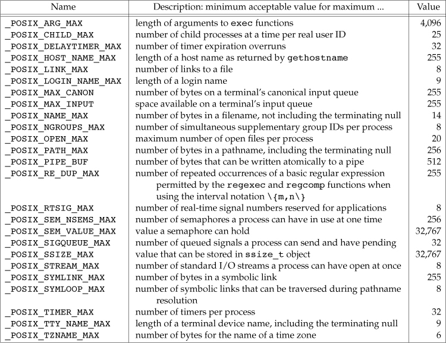
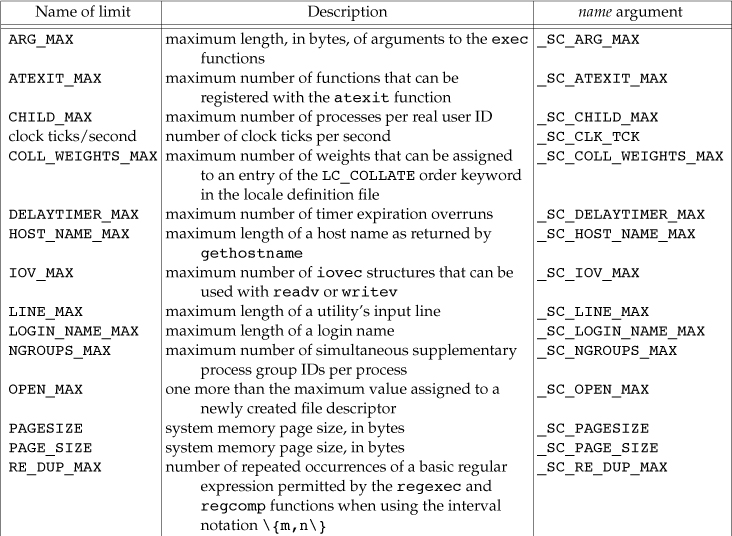
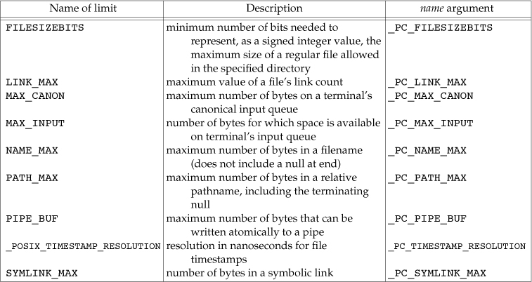
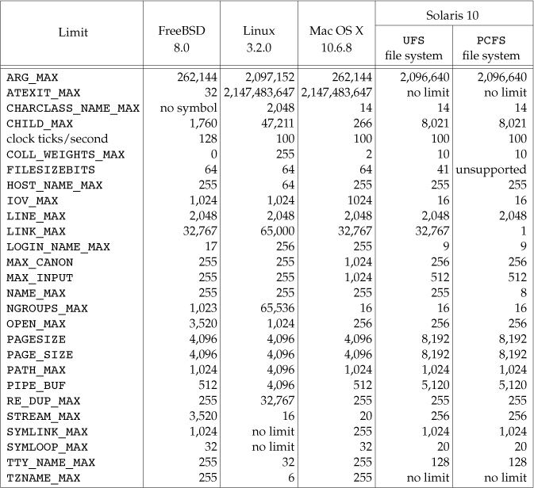

# Unix Standardization

## Standars

### ISO C Standard

* Headers Defined by ISO Standard


### POSIX Standard

* Required Headers defined by POSIX Standard


* XSI option headers defined by POSIX Standard


* Optinal headers defined by POSIX Standard


* Its interfaces are divided into required ones and optional ones.
  * The optional interfaces are further divided into 40 sections, based on functionality.

* POSIX.1 optional interface groups and codes


### Single Unix Specification(SUS)

The Single UNIX Specification, a superset of the POSIX.1 standard, specifies additional interfaces that extend the functionality provided by the POSIX.1 specification. POSIX.1 is equivalent to the Base Specifications portion of the Single UNIX Specification.

---

## Unix System Implementations

* Linux
  * Linux is an operating system that provides a rich programming environment similar to that of a UNIX System; it is freely available under the GNU Public License. The popularity of Linux is somewhat of a phenomenon in the computer industry. Linux is distinguished by often being the first operating system to support new hardware.

## Limits

### ISO C Limits

* Sizes of integral values from <limits.h>


* The floating-point data types in the header <float.h> have a similar set of definitions. 

* POSIX.1 makes extensions to the C standard. To conform to POSIX.1, an implementation must support a minimum value of 2,147,483,647 for INT_MAX, –2,147,483,647 for INT_MIN, and 4,294,967,295 for UINT_MAX. Because POSIX.1 requires implementations to support an 8-bit char, CHAR_BIT must be 8, SCHAR_MIN must be –128, SCHAR_MAX must be 127, and UCHAR_MAX must be 255.

* Another ISO C constant that we’ll encounter is FOPEN_MAX, the minimum number of standard I/O streams that the implementation guarantees can be open at once. This constant is found in the <stdio.h> header, and its minimum value is 8. The POSIX.1 value STREAM_MAX, if defined, must have the same value as FOPEN_MAX.

* ISO C also defines the constant TMP_MAX in <stdio.h>. It is the maximum number of unique filenames generated by the tmpnam function.

* Although ISO C defines the constant FILENAME_MAX, we avoid using it, because POSIX.1 provides better alternatives (NAME_MAX and PATH_MAX). 


### POSIX Limits

POSIX.1 defines numerous constants that deal with implementation limits of the operating system.

* Although POSIX.1 defines numerous limits and constants, we’ll concern ourselves with only the ones that affect the base POSIX.1 interfaces.
  * These limits and constants are divided into the following seven categories:

1. Numerical limits: LONG_BIT, SSIZE_MAX, and WORD_BIT

2. Minimum values: the 25 constants in Figure
  

3. Maximum value: _POSIX_CLOCKRES_MIN

4. Runtime increasable values: CHARCLASS_NAME_MAX, COLL_WEIGHTS_MAX, LINE_MAX, NGROUPS_MAX, and RE_DUP_MAX

5. Runtime invariant values, possibly indeterminate: the 17 constants

   

6. Other invariant values: NL_ARGMAX, NL_MSGMAX, NL_SETMAX, and NL_TEXTMAX

7. Pathname variable values: FILESIZEBITS, LINK_MAX, MAX_CANON, MAX_INPUT, NAME_MAX, PATH_MAX, PIPE_BUF, and SYMLINK_MAX 

Of these limits and constants, some may be defined in <limits.h>, and others may or may not be defined, depending on certain conditions. 	

These minimum values do not change from one system to another. They specify the most restrictive values for these features.

> This is why they are called minimums, although their names all contain MAX.

A strictly conforming POSIX application is different from an application that is merely POSIX conforming. A POSIX-conforming application uses only interfaces defined in IEEE Standard 1003.1-2008. A strictly conforming POSIX application must meet further restrictions, such as not relying on any undefined behavior, not using any obsolescent interfaces, and not requiring values of constants larger than the minimums

Unfortunately, some of these invariant minimum values are too small to be of practical use. For example, most UNIX systems today provide far more than 20 open files per process. Also, the minimum limit of 256 for _POSIX_PATH_MAX is too small. Pathnames can exceed this limit. This means that we can’t use the two constants _POSIX_OPEN_MAX and _POSIX_PATH_MAX as array sizes at compile time.

For example, a particular value may not be included in the header if its actual value for a given process depends on the amount of memory on the system. If the values are not defined in the header, we can’t use them as array bounds at compile time. To determine the actual implementation value at runtime, POSIX.1 decided to provide three functions for us to call—sysconf, pathconf, and fpathconf. 

### XSI Limits

1. SI minimum values from <limits.h>


2. Runtime invariant values, possibly indeterminate: IOV_MAX and PAGE_SIZE

* The last two illustrate the situation in which the POSIX.1 minimums were too small—presumably to allow for embedded POSIX.1 implementations—so symbols with larger minimum values were added for XSI-conforming systems.

### sysconf, pathconf, and fpathconf Functions

The runtime limits are obtained by calling one of the following three functions.

```c
#include<unistd.h>

long sysconf(int name);
long pathconf(const char* pathname, int name);
long fpathconf(int fd, int name);

// If OK returns corresponding value
// if fails returns -1 
```

* The difference between the last two functions is that one takes a pathname as its argument and the other takes a file descriptor argument.

* Constants beginning with _PC_ are used as arguments to pathconf and fpathconf to identify the runtime limit.

* Constants beginning with _SC_ are used as arguments to sysconf to identify the runtime limit. 

* Limits and name arguments to sysconf



* Limits and name arguments to pathconf and fpathconf



We need to look in more detail at the different return values from these three functions.

1. All three functions return –1 and set errno to EINVAL if the name isn’t one of the appropriate constants.

2. Some names can return either the value of the variable (a return value ≥ 0) or an indication that the value is indeterminate. An indeterminate value is indicated by returning –1 and not changing the value of errno.

3.  The value returned for _SC_CLK_TCK is the number of clock ticks per second, for use with the return values from the times function

Some restrictions apply to the pathconf pathname argument and the fpathconf fd argument. If any of these restrictions isn’t met, the results are undefined.

1. The referenced file for _PC_MAX_CANON and _PC_MAX_INPUT must be a terminal file.

2. The referenced file for _PC_LINK_MAX and _PC_TIMESTAMP_RESOLUTION can be either a file or a directory. If the referenced file is a directory, the return value applies to the directory itself, not to the filename entries within the directory.

3. The referenced file for _PC_FILESIZEBITS and _PC_NAME_MAX must be a directory. The return value applies to filenames within the directory.

4. The referenced file for _PC_PATH_MAX must be a directory. The value returned is the maximum length of a relative pathname when the specified directory is the working directory.(Unfortunately, this isn’t the real maximum length of an absolute pathname, which is what we want to know. We’ll return to this)

5. The referenced file for _PC_PIPE_BUF must be a pipe, FIFO, or directory. In the first two cases (pipe or FIFO), the return value is the limit for the referenced pipe or FIFO. For the other case (a directory), the return value is the limit for any FIFO created in that directory.

6. The referenced file for _PC_SYMLINK_MAX must be a directory. The value returned is the maximum length of the string that a symbolic link in that directory can contain.


* The awk program shown in below builds a C program that prints the value of each pathconf and sysconf symbol.

```awk

#!/usr/bin/awk -f
BEGIN   {
    printf("#include \"apue.h\"\n")
    printf("#include <errno.h>\n")
    printf("#include <limits.h>\n")
    printf("\n")
    printf("static void pr_sysconf(char *, int);\n")
    printf("static void pr_pathconf(char *, char *, int);\n")
    printf("\n")
    printf("int\n")
    printf("main(int argc, char *argv[])\n")
    printf("{\n")
    printf("\tif (argc != 2)\n")
    printf("\t\terr_quit(\"usage: a.out <dirname>\");\n\n")
    FS="\t+"
    while (getline <"sysconf.sym" > 0) {
        printf("#ifdef %s\n", $1)
        printf("\tprintf(\"%s defined to be %%ld\\n\", (long)%s+0);\n",
             $1, $1)
        printf("#else\n")
        printf("\tprintf(\"no symbol for %s\\n\");\n", $1)
        printf("#endif\n")
        printf("#ifdef %s\n", $2)
        printf("\tpr_sysconf(\"%s =\", %s);\n", $1, $2)
        printf("#else\n")
        printf("\tprintf(\"no symbol for %s\\n\");\n", $2)
        printf("#endif\n")
    }
    close("sysconf.sym")
    while (getline <"pathconf.sym" > 0) {
        printf("#ifdef %s\n", $1)
        printf("\tprintf(\"%s defined to be %%ld\\n\", (long)%s+0);\n",
            $1, $1)
        printf("#else\n")
        printf("\tprintf(\"no symbol for %s\\n\");\n", $1)
        printf("#endif\n")
        printf("#ifdef %s\n", $2)
        printf("\tpr_pathconf(\"%s =\", argv[1], %s);\n", $1, $2)
        printf("#else\n")
        printf("\tprintf(\"no symbol for %s\\n\");\n", $2)
        printf("#endif\n")
    }
    close("pathconf.sym")
    exit
}
END {
    printf("\texit(0);\n")
    printf("}\n\n")
    printf("static void\n")
    printf("pr_sysconf(char *mesg, int name)\n")
    printf("{\n")
    printf("\tlong  val;\n\n")
    printf("\tfputs(mesg, stdout);\n")
    printf("\terrno = 0;\n")
    printf("\tif ((val = sysconf(name)) < 0) {\n")
    printf("\t\tif (errno != 0) {\n")
    printf("\t\t\tif (errno == EINVAL)\n")
    printf("\t\t\t\tfputs(\" (not supported)\\n\", stdout);\n")
    printf("\t\t\telse\n")
    printf("\t\t\t\terr_sys(\"sysconf error\");\n")
    printf("\t\t} else {\n")
    printf("\t\t\tfputs(\" (no limit)\\n\", stdout);\n")
    printf("\t\t}\n")
    printf("\t} else {\n")
    printf("\t\tprintf(\" %%ld\\n\", val);\n")
    printf("\t}\n")
    printf("}\n\n")
    printf("static void\n")
    printf("pr_pathconf(char *mesg, char *path, int name)\n")
    printf("{\n")
    printf("\tlong val;\n")
    printf("\n")
    printf("\tfputs(mesg, stdout);\n")
    printf("\terrno = 0;\n")
    printf("\tif ((val = pathconf(path, name)) < 0) {\n")
    printf("\t\tif (errno != 0) {\n")
    printf("\t\t\tif (errno == EINVAL)\n")
    printf("\t\t\t\tfputs(\" (not supported)\\n\", stdout);\n")
    printf("\t\t\telse\n")
    printf("\t\t\t\terr_sys(\"pathconf error, path = %%s\", path);\n")
    printf("\t\t} else {\n")
    printf("\t\t\tfputs(\" (no limit)\\n\", stdout);\n")
    printf("\t\t}\n")
    printf("\t} else {\n")
    printf("\t\tprintf(\" %%ld\\n\", val);\n")
    printf("\t}\n")
    printf("}\n")
}

```

* Below Summarizes the results

```c
/* Print All Possible Values */
#include "apue.h"
#include <errno.h>
#include <limits.h>

static void pr_sysconf(char *, int);
static void pr_pathconf(char *, char *, int);

int
main(int argc, char *argv[])
{
    if (argc != 2)
        err_quit("usage: a.out <dirname>");
#ifdef ARG_MAX
    printf("ARG_MAX defined to be %ld\n", (long)ARG_MAX+0);
#else
    printf("no symbol for ARG_MAX\n");
#endif
#ifdef _SC_ARG_MAX
    pr_sysconf("ARG_MAX =", _SC_ARG_MAX);
#else
    printf("no symbol for _SC_ARG_MAX\n");
#endif
/* similar processing for all the rest of the sysconf symbols... */
#ifdef MAX_CANON
    printf("MAX_CANON defined to be %ld\n", (long)MAX_CANON+0);
#else
    printf("no symbol for MAX_CANON\n");
#endif
#ifdef _PC_MAX_CANON
    pr_pathconf("MAX_CANON =", argv[1], _PC_MAX_CANON);
#else
    printf("no symbol for _PC_MAX_CANON\n");
#endif
/* similar processing for all the rest of the pathconf symbols... */
    exit(0);
}
static void
pr_sysconf(char *mesg, int name)
{
    long    val;
    fputs(mesg, stdout);
    errno = 0;
    if ((val = sysconf(name)) < 0) {
        if (errno != 0) {
            if (errno == EINVAL)
                fputs(" (not supported)\n", stdout);
            else
                err_sys("sysconf error");
        } else {
            fputs(" (no limit)\n", stdout);
        }
    } else {
        printf(" %ld\n", val);
    }
}
static void
pr_pathconf(char *mesg, char *path, int name)
{
    long    val;
    fputs(mesg, stdout);
    errno = 0;
    if ((val = pathconf(path, name)) < 0) {
        if (errno != 0) {
            if (errno == EINVAL)
                fputs(" (not supported)\n", stdout);
            else
                err_sys("pathconf error, path = %s", path);
        } else {
            fputs(" (no limit)\n", stdout);
        }
    } else {
        printf(" %ld\n", val);
    }
}


```

* The entry “no symbol” means that the system doesn’t provide a corresponding _SC or _PC symbol to query the value of the constant.
  * Thus the limit is undefined in this case.

* The entry “unsupported” means that the symbol is defined by the system but unrecognized by the sysconf or pathconf functions.

* The entry “no limit” means that the system defines no limit for the constant, but this doesn’t mean that the limit is infinite; it just means that the limit is indeterminite.

> Beware that some limits are reported incorrectly. For example, on Linux, SYMLOOP_MAX is reportedly unlimited, but an examination of the source code reveals that there is actually a hard-coded limit of 40 for the number of consecutive symbolic links traversed in the absence of a loop (see the follow_link function in fs/namei.c).


* Another potential source of inaccuracy in Linux is that the pathconf and fpathconf functions are implemented in the C library. The configuration limits returned by these functions depend on the underlying file system type, so if your file system is unknown to the C library, the functions return an educated guess.

* Example of Configuration Limits

 


### Indeterminate Runtime Limits

We mentioned that some of the limits can be indeterminate. The problem we encounter is that if these limits aren’t defined in the <limits.h> header, we can’t use them at compile time.

But they might not be defined at runtime if their value is indeterminate! Let’s look at two specific cases: allocating storage for a pathname and determining the number of file descriptors.

#### Pathnames

Many programs need to allocate storage for a pathname. Typically, the storage has been allocated at compile time, and various magic numbers—few of which are the correct value—have been used by different programs as the array size: 256, 512, 1024, or the standard I/O constant BUFSIZ.

* POSIX.1 tries to help with the PATH_MAX value, but if this value is indeterminate, we’re still out of luck.

* Dynamically Allocate Space For Pathname
  * Shows a function that we’ll use throughout this text to allocate storage dynamically for a pathname.

```c
#include "apue.h"
#include <errno.h>
#include <limits.h>

#ifdef  PATH_MAX
static long pathmax = PATH_MAX;
#else
static long pathmax = 0;
#endif

static long posix_version = 0;
static long xsi_version = 0;

/* If PATH_MAX is indeterminate, no guarantee this is adequate */
#define PATH_MAX_GUESS  1024

char *
path_alloc(size_t *sizep) /* also return allocated size, if nonnull */
{
    char    *ptr;
    size_t  size;

    if (posix_version == 0)
        posix_version = sysconf(_SC_VERSION);

    if (xsi_version == 0)
        xsi_version = sysconf(_SC_XOPEN_VERSION);

    if (pathmax == 0) {     /* first time through */
        errno = 0;
        if ((pathmax = pathconf("/", _PC_PATH_MAX)) < 0) {
            if (errno == 0)
                pathmax = PATH_MAX_GUESS;   /* it′s indeterminate */
            else
                err_sys("pathconf error for _PC_PATH_MAX");
        } else {
            pathmax++;      /* add one since it′s relative to root */
        }
    }
    /*
     * Before POSIX.1-2001, we aren′t guaranteed that PATH_MAX includes
     * the terminating null byte.  Same goes for XPG3.
     */
    if ((posix_version < 200112L) && (xsi_version < 4))
        size = pathmax + 1;
    else
        size = pathmax;

    if ((ptr = malloc(size)) == NULL)
        err_sys("malloc error for pathname");

    if (sizep != NULL)
        *sizep = size;
    return(ptr);
}
```

* If the constant PATH_MAX is defined in <limits.h>, then we’re all set. If it’s not, then we need to call pathconf.

* The value returned by pathconf is the maximum size of a relative pathname when the first argument is the working directory, so we specify the root as the first argument and add 1 to the result.
  * If pathconf indicates that PATH_MAX is indeterminate, we have to punt and just guess a value.

* Versions of POSIX.1 prior to 2001 were unclear as to whether PATH_MAX included a null byte at the end of the pathname. If the operating system implementation conforms to one of these prior versions and doesn’t conform to any version of the Single UNIX Specification (which does require the terminating null byte to be included), we need to add 1 to the amount of memory we allocate for a pathname, just to be on the safe side.


